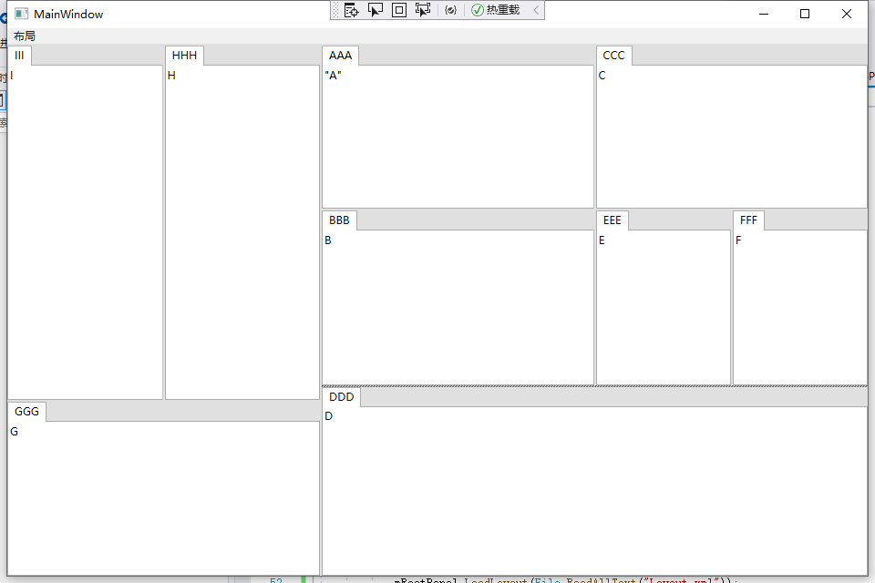

## General WPF Control Library

### [RenderView](./Views/Renders)

一个带有HWND的自定义视图，主要是为了实现在WPF中嵌入Vulkan，理论上，有了HWND，无论是嵌入OpenGL、Vulkan还是DirectX，都不是问题  
A custom view which has a HWND, in order to embed Vulkan in WPF, you can embed OpenGL, Vulkan or DirectX with a HWND in theory

### [TabPanel](./Views/Tabs)

一个可以随意拖拽的标签页，可以把分页拖出来独立布局，也可以再拖回去合并在一起，各种编辑器最基础的布局方式，就像这样：  
A tab panel which can drag tab item out as a standard window, or drop tab item in to merge them, like common editors support:  

目前只支持单个标签页的初始化设置：  
```
<General:TabPanel.Items>
    <General:TabItem Header="AAA">"A"</General:TabItem>
    <General:TabItem Content="B" Header="BBB"/>
    <General:TabItem Content="C" Header="CCC"/>
    <General:TabItem Content="D" Header="DDD"/>
    <General:TabItem Content="E" Header="EEE"/>
    <General:TabItem Content="F" Header="FFF"/>
    <General:TabItem Content="G" Header="GGG"/>
    <General:TabItem Content="H" Header="HHH"/>
    <General:TabItem Content="I" Header="III"/>
</General:TabPanel.Items>
```

### [TreeView](./Views/TreeViews)

一个可以编辑Item名的TreeView，可以通过以下方式触发编辑状态：
- 连续点击2次Item (Click *Item* twice)
- 通过TreeView.Edit触发 (Use *TreeView.Edit*)

可以通过以下方式提交编辑：
- 按下键盘Enter键 (Press *Enter*)
- 使Item或者TextBox失去焦点 (Make *Item* or *TextBox* lost focus)
- 通过TreeView.Commit提交 (Use TreeView.Commit)